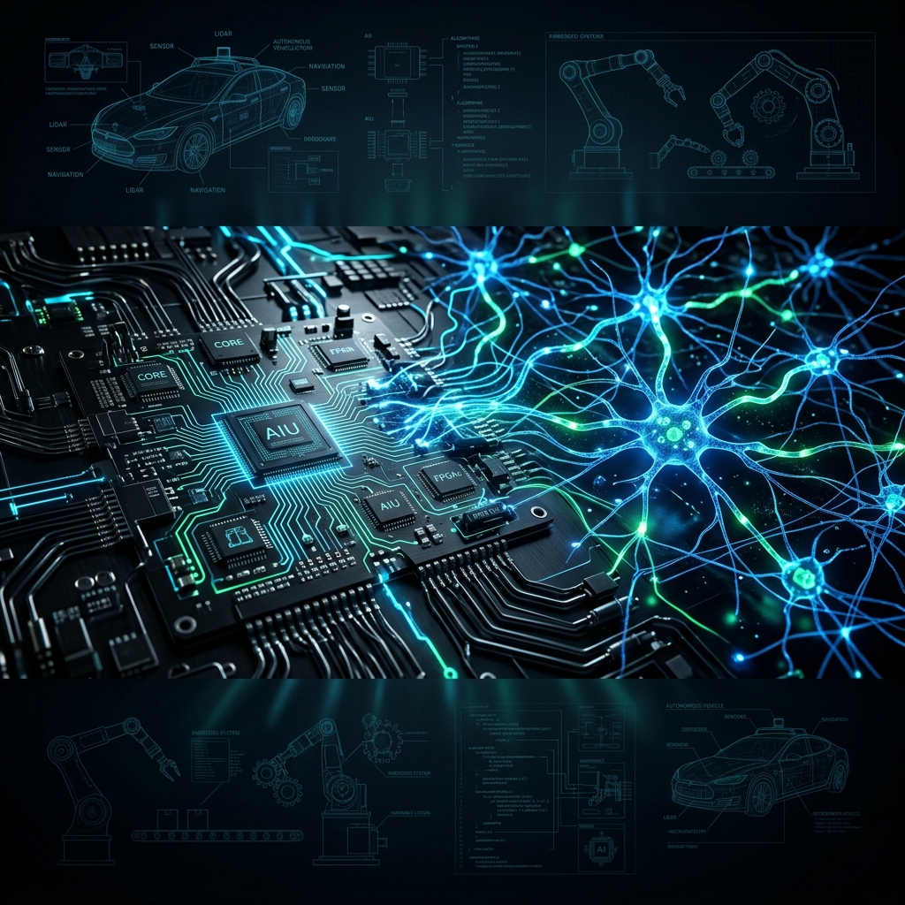
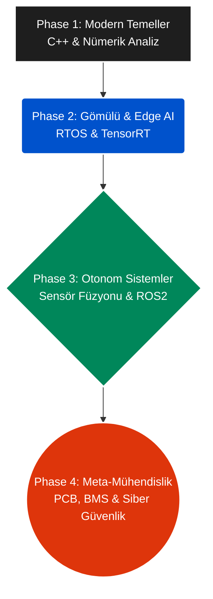

<div align="center">


  <br>
  
  [](.github/workflows)
  [](docs/)
  [](docs/)
  [](#)
  
  <h3><strong>Gelecek, sadece kod yazabilenleri değil; zekayı metalin kalbine gömebilen mimarları bekliyor.</strong></h3>
</div>

---

> [!IMPORTANT]
> **Mimari Ekosistem ve Temeller:** Bu depo, **[EEE-Encyclopedia](https://github.com/arch-yunus/EEE-Encyclopedia)** ile bir bütündür. Eğer temel devre teorisi, komponent analizi ve akademik EEM temellerinizde eksiklik varsa, önce o ansiklopediyi hazmetmeniz önerilir. Bu depo (Post-AI), o devasa temelin üzerine inşa edilen, makinenin çaresiz kaldığı sınırları zorlayan *Otonom Donanım* ve *Meta-Mühendislik* kuluçkasıdır.

---

## 🏴‍☠️ Manifesto: Neden Yeni Bir Müfredat?

> *"Yapay zeka artık salt bir 'kod yazıcısı' olmakla kalmıyor. Devre teorisini saniyeler içinde denklemleştiren, diferansiyel denklemleri modelleyen, otonom PCB yönlendirmeleri tasarlayan ajanların çağındayız. Eğer bir Elektronik Mühendisi 'hesap makinesi' olmanın güvencesine sığınıyorsa, o güvence en fazla birkaç ay daha sürecektir."*

### Klasik Mühendisliğin Varoluşsal Krizi
Öğrenciler üniversitelerde 4 yıl boyunca tahta üzerinde integral çözüp laboratuvarda düğüm (Nodal) hesaplamaları yaparken, bu teorik "sayısal hamallığın" endüstrideki karşılığı artık tek bir doğru yapay zeka promptuna denk düşüyor. Yapay zekanın tüm hesaplamaları, algoritmaları ve tasarımları tek başına yapmasının "zaman meselesi" bile olmadığı, an meselesi olduğu bir dönemdeyiz.

### Meta-Mühendislik: Makinenin Çaresiz Kaldığı Sınır
Yapay zekanın kodu ve matematiği ne kadar kusursuz olursa olsun aşamadığı tek bir sınır var: **Gerçek dünyanın fiziksel entropisi.**
Artık değer yaratılan asıl alan ekrandaki salt teorik hesabı yapmak değil; **fiziksel sistem entegrasyonu, termal dar boğazları (overheating) aşmak, sensörlerin doğadaki fiziksel gürültüsüyle (noise) başa çıkmak, batarya (BMS) güç yönetimi ve siber-fiziksel donanım güvenliğidir.**

Bu müfredat, makineyle hesap yapma yarışına giren değil; dışarıdan bağımsız şekilde uçtan uca otonom ürünler geliştiren, zekayı metalin kalbine gömen ve donanımla yazılımın kusursuz köprüsünü kuran yepyeni bir tür, **"Meta-Mühendis (Sistem Mimarı)"** yetiştirmek için inşâ edilmiştir.

<br>

## 🔬 Teknolojik İnceleme: Kutunun İçinde Ne Var? (Deep Dive)

Bu depo, standart üniversite EEM okumalık bir kitap değildir. İçeri girdiğinde şu tarz **gerçek endüstri (production-ready)** kod mimarileri ve hesaplamalar ile karşılaşacaksın:

#### 1️⃣ C++ ile Nümerik Fizik Motoru (Phase 1)
*"Standart kontrol simülasyonları Simulink lisanslarına bağlıdır. Burada ise donanımın modellemesini doğrudan C++ RK4 algoritmasıyla baştan yazıyoruz."*
```cpp
// 4. Dereceden Runge-Kutta (RK4) ile Non-Linear State Equation Çözümü
double k1_q = f1(i);
double k1_i = f2(q, i);
// Zaman/Step Bazlı Sistem Entegrasyonu (dt)
q += (dt / 6.0) * (k1_q + 2.0 * k2_q + 2.0 * k3_q + k4_q);
i += (dt / 6.0) * (k1_i + 2.0 * k2_i + 2.0 * k3_i + k4_i);
```

#### 2️⃣ RTOS Eşzamanlı Yarış Durumu (Race Condition) (Phase 2)
*"Aynı anda GPS okuyan ve Yüksek Amperli Motor süren bir sensörün belleği çökertmemesi (Memory Leak) için gereken katı eşzamanlı kilit mekanizmaları."*
```cpp
// Eşzamanlı (Concurrent) hafıza erişimi güvenliği (Cortex-M standardı)
void sensor_task() {
    while (is_running) {
        std::lock_guard<std::mutex> lock(system_mutex); // Lock Thread!
        shared_sensor_value += 1; // Veri izole edildi, güvenli yazma.
    }
}
```

#### 3️⃣ Python NumPy ile Extended Kalman Filter (EKF) (Phase 3)
*"Kirli ve gürültülü (Noisy) sensörlerin Lidar ve GPS ile füzyonlanarak gerçek araba konumunu (True State) bulmasının saf matematiksel çekirdeği."*
```python
# Kalman Gain (K) ve Covariance Update (Sensör ve Klasik Fizik Matris Çarpışması)
S = np.dot(H, np.dot(P_pred, H.T)) + R
K = np.dot(P_pred, np.dot(H.T, np.linalg.inv(S)))
x = x_pred + np.dot(K, y) # Fizik Tahmini + Sensör Düzeltmesi = Absolute Truth
```

#### 4️⃣ Çip Seviyesi Kriptografi: Secure Telemetry (Phase 4)
*"Hacklenen bir otonom cihaz aslında canlı bir silahtır (Drone vs.). Asimetrik doğrulama ile MITM (Orta Adam) saldırısını donanımsal reddet."*
```python
# Payload'a çip içine gömülü (TPM) donanımsal salt eklenerek SHA-256 Hash imzası alınması
content_to_sign = payload + self.secret_salt
signature = hashlib.sha256(content_to_sign).hexdigest()
# Sistem signature eşleşmez ise ağı anında düşürür (Kill-Switch aktifleştirir).
```

<br>

## 🧩 Sistem Mimarisi (Evolüsyon Grafiği)

Aşağıdaki şema, sıfırdan otonom bir sistem dizaynına giden yolun aşamalarını gösterir.



<br>

## ⚖️ Paradigma Değişimi: Klasik EEM vs Meta-Mühendislik

| Kategori | Geleneksel Üniversite EEM | Meta-Mühendislik (Bu Repo) | Sonuç |
| :--- | :--- | :--- | :--- |
| **Matematik** | Tahtada elle türev/integral hesaplamak. | Kağıdı bırakıp integrali `C++` Nümerik Motoru ile hesaplamak. | Makinenin hızına ulaşmak. |
| **Gömülü Sistemler** | Arduino'da `delay(100)` yazarak LED yakmak. | `FreeRTOS` ve `std::mutex` ile donanımsal yarış kilitleri kurmak. | Endüstriyel seviyede güvenilirlik. |
| **Yapay Zeka** | Hazır modeli buluttan çağıran Python scripti. | NVIDIA Jetson donanımında `TensorRT Int8` optimizasyonuyla modeli metale gömmek. | Milisaniye bazlı Edge AI gecikmesizliği. |
| **Sensör/Donanım** | Çıkan hatayı print("hata") ile okumak. | Logic Analyzer, Osiloskop ve Extended Kalman Filter ile pürüzsüz veri almak. | Fiziksel tolerans limitsizliği. |

<br>

## 🗺️ Otonom Sistem Mimarı Yol Haritası (Curriculum)

Bu depo salt okumalık değil; kod kodlandığı, derlendiği ve test edildiği **aktif bir laboratuvardır.** Tüm projeler `projects/` dizininde çalıştırılabilir halde seni bekliyor.

| Faz | Odak Noktası | Ana Teknolojiler | İnşa Edilen Projeler |
| :--- | :--- | :--- | :--- |
| **[Phase 1](./01_Phase1_Modern_Temeller.md)** | Modern Temeller | `C++`, `Python`, `RK4 Math` | **[Proje 1.0]** Diferansiyel RK4 Fizik Motoru (`CircuitSimulator`) | 
| **[Phase 2](./02_Phase2_Gomulu_Sistemler_Edge_AI.md)** | Gömülü & Uç Yapay Zeka | `FreeRTOS`, `Cortex-M`, `Muteks`| **[Proje 2.0]** Multi-Threading RTOS Simülatörü | 
| **[Phase 3](./03_Phase3_Otonom_Sistemler_Sensor_Fuzyonu.md)**| Otonom Sistemler & Füzyon| `ROS2`, `Kalman`, `NumPy` | **[Proje 3.0]** Otonom 1D Lidar/GPS Sensör Füzyonu (EKF) | 
| **[Phase 4](./04_Phase4_Meta_Muhendislik_Sistem_Mimarisi.md)**| Meta-Mühendislik | `KiCad`, `MQTT`, `RSA/AES` | **[Proje 4.0]** Asimetrik Kriptografik Secure Telemetri (IoT) | 

<br>

## 🛠️ Temel Teknoloji Yığını (Tech Stack)

<div align="center">
  
  <br>
  
</div>

<br>

## 📂 Depo Düzeni (Repository Structure)

<details>
<summary><b>Projelerin ve Notların Ev Sahibi Klasör Yapısını İncele (Tıkla)</b></summary>

```text
/Post-AI-EEE-Curriculum
│
├── .github/workflows/          # Bulut üzerinde kod derleme otomasyonları (CI/CD)
├── notes/                      # Monk Mode günlükleri (Second Brain)
│   └── Monk_Mode_Daily_Template.md
│
├── projects/                   # Gerçek Dünya Ar-Ge Projeleri
│   ├── Phase1_Modern_Temeller/       
│   ├── Phase2_Gomulu_Sistemler/     
│   ├── Phase3_Otonom_Sistemler/     
│   └── Phase4_Meta_Muhendislik/      
│
├── 01_Phase1_Modern_Temeller.md        
├── 02_Phase2_Gomulu_Sistemler_Edge_AI.md  
├── 03_Phase3_Otonom_Sistemler_Sensor_Fuzyonu.md
└── 04_Phase4_Meta_Muhendislik_Sistem_Mimarisi.md
```
</details>

<br>

## 🏆 Kariyer Çıktısı: Ne Olacaksın? 
Bu müfredat sana standart bir "Elektrik Mühendisi" unvanı değil, aşağıdaki endüstriyel pozisyonların yetkinliğini kazandırır:
* **Autonomous Systems Architect (Otonom Sistem Mimarı):** Silah sistemlerinden, tarım dronelarına kadar tüm insansız araçların beynini kodlayan kişi.
* **Edge-AI Firmware Engineer:** Bulut tabanlı API yazılım dünyasından çok daha saygın; doğrudan çipler üzerine yapay zeka modelleri inşâ eden kişi.

<br>

## 🧠 Çalışma Metodolojisi (Monk Mode Framework)
Pür dikkat odaklanma (Monk Mode) gerektiren bu müfredatı hayata geçirirken uyman gereken 3 altın kural:
1. **Teoriyi Özümse (Information Diet):** Konuyu en iyi kaynaklardan tüket, ancak `%20 Okuma, %80 İnşa Etme` kuralına uy.
2. **Donanıma Dök (Code-First Theory):** Sadece simülasyonda veya kağıt üzerinde kalma. Formülü silisyuma (Jetson/MCU) derle.
3. **Belgele (Documentation as Proof):** Başarısızlıklarını ve teknik ispatlarını `/notes` içine Markdown olarak kaydet. 

<br>

## 🤝 Katkıda Bulunma (Contributing)
Açık kaynak komünitesi bu felsefeyi geliştirmek için bekliyor! Bir modül hatası bulursanız veya "Şu algoritmayı da C++ a döksek efsane olur" derseniz `Pull Request` (PR) atarak otonom geleceğimizin bir parçası olabilirsiniz.

## 📄 Lisans
Bu depo **MIT Lisansı** ile sunulmaktadır. Özgürce alın, kodlayın, ticarileştirin ve değiştirerek otonom geleceği hızlandırın.

---
<div align="center">
  <i>Teori seni mülakatlardan geçirir. Donanım ve kod üretimden (production) geçirir. Direksiyona geç.</i>
</div>