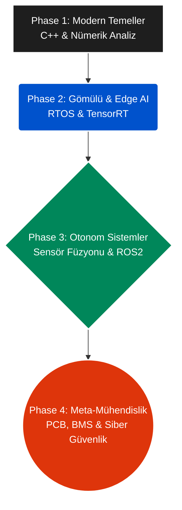

<div align="center">
  

  <br>
  
  [](.github/workflows)
  [](docs/)
  [](docs/)
  [](#)
  
  <h3><strong>Gelecek, sadece kod yazabilenleri değil; zekayı metalin kalbine gömebilen mimarları bekliyor.</strong></h3>
</div>

---

## 🏴‍☠️ Manifesto: Neden Yeni Bir Müfredat?

> *"Yapay zeka (LLM'ler, Copilot'lar) saniyeler içinde binlerce satır kod yazabildiği, standart kontrol kodlarını sentezleyebildiği bir çağda, geleneksel mühendislik eğitimi varoluşsal bir krize girmiştir."*

Artık asıl mühendislik dar boğazı ekrandaki salt yazılım değil; **fiziksel sistem entegrasyonu, enerji yönetimi, sensör-mekanik uyumu ve donanım limitleridir.** 

Öğrenciler 4 yıl boyunca tahta üzerinde integral çözüp laboratuvarda direnç okurken, dışarıdaki endüstri ROS2 C++ düğümleri ile Lidar sensörlerini otonom sistemlere bağlıyor, NVIDIA Jetson üzerinde TensorRT ile ağır AI modellerini uç cihazlara sığdırıyor.

Bu müfredat; dışarıdan bağımsız şekilde uçtan uca fiziksel ve zeki ürünler geliştirebilen, otonom sistemleri kavrayan ve siber-fiziksel güvenliği anlayan yeni nesil **"Meta-Mühendisler"** için bir inşa kuluçkasıdır.

<br>

## 🧩 Sistem Mimarisi (Evolüsyon Grafiği)

Aşağıdaki şema, sıfırdan otonom bir sistem dizaynına giden yolun aşamalarını gösterir.



<br>

## 🗺️ Otonom Sistem Mimarı Yol Haritası (Curriculum)

Bu depo salt okumalık değil; kod kodlandığı, derlendiği ve test edildiği **aktif bir laboratuvardır.** Tüm projeler `projects/` dizininde çalıştırılabilir halde seni bekliyor.

| Faz | Odak Noktası | Ana Teknolojiler | İnşa Edilen Projeler |
| :--- | :--- | :--- | :--- |
| **[Phase 1](./01_Phase1_Modern_Temeller.md)** | Modern Temeller | `C++`, `Python`, `RK4 Math` | **[Proje 1.0]** Diferansiyel RK4 Motoru (`CircuitSimulator`) | 
| **[Phase 2](./02_Phase2_Gomulu_Sistemler_Edge_AI.md)** | Gömülü & Uç Yapay Zeka | `FreeRTOS`, `Cortex-M`, `Muteks`| **[Proje 2.0]** Multi-Threading RTOS Simülatörü | 
| **[Phase 3](./03_Phase3_Otonom_Sistemler_Sensor_Fuzyonu.md)**| Otonom Sistemler & Füzyon| `ROS2`, `Kalman`, `NumPy` | **[Proje 3.0]** Otonom 1D Lidar/GPS Sensör Füzyonu (EKF) | 
| **[Phase 4](./04_Phase4_Meta_Muhendislik_Sistem_Mimarisi.md)**| Meta-Mühendislik | `KiCad`, `MQTT`, `RSA/AES` | **[Proje 4.0]** Asimetrik Kriptografik Secure Telemetri (IoT) | 

<br>

## 🛠️ Temel Teknoloji Yığını (Tech Stack)

<div align="center">
  
  <br>
  
</div>

<br>

## 📂 Depo Düzeni (Repository Structure)

<details>
<summary><b>Projelerin ve Notların Ev Sahibi Klasör Yapısını İncele (Tıkla)</b></summary>

```text
/Post-AI-EEE-Curriculum
│
├── .github/workflows/          # Bulut üzerinde kod derleme otomasyonları (CI/CD)
├── notes/                      # Monk Mode günlükleri (Second Brain)
│   └── Monk_Mode_Daily_Template.md
│
├── projects/                   # Gerçek Dünya Ar-Ge Projeleri
│   ├── Phase1_Modern_Temeller/       
│   ├── Phase2_Gomulu_Sistemler/     
│   ├── Phase3_Otonom_Sistemler/     
│   └── Phase4_Meta_Muhendislik/      
│
├── 01_Phase1_Modern_Temeller.md        
├── 02_Phase2_Gomulu_Sistemler_Edge_AI.md  
├── 03_Phase3_Otonom_Sistemler_Sensor_Fuzyonu.md
└── 04_Phase4_Meta_Muhendislik_Sistem_Mimarisi.md
```
</details>

<br>

## 🧠 Çalışma Metodolojisi (Monk Mode Framework)
Pür dikkat odaklanma (Monk Mode) gerektiren bu müfredatı hayata geçirirken uyman gereken 3 altın kural:
1. **Teoriyi Özümse (Information Diet):** Konuyu en iyi kaynaklardan tüket, ancak `%20 Okuma, %80 İnşa Etme` kuralına uy.
2. **Donanıma Dök (Code-First Theory):** Sadece simülasyonda veya kağıt üzerinde kalma. Formülü silisyuma (Jetson/MCU) derle.
3. **Belgele (Documentation as Proof):** Başarısızlıklarını ve teknik ispatlarını `/notes` içine Markdown olarak kaydet. 

---
<div align="center">
  <i>Teori seni mülakatlardan geçirir. Donanım ve kod üretimden (production) geçirir. Direksiyona geç.</i>
</div>